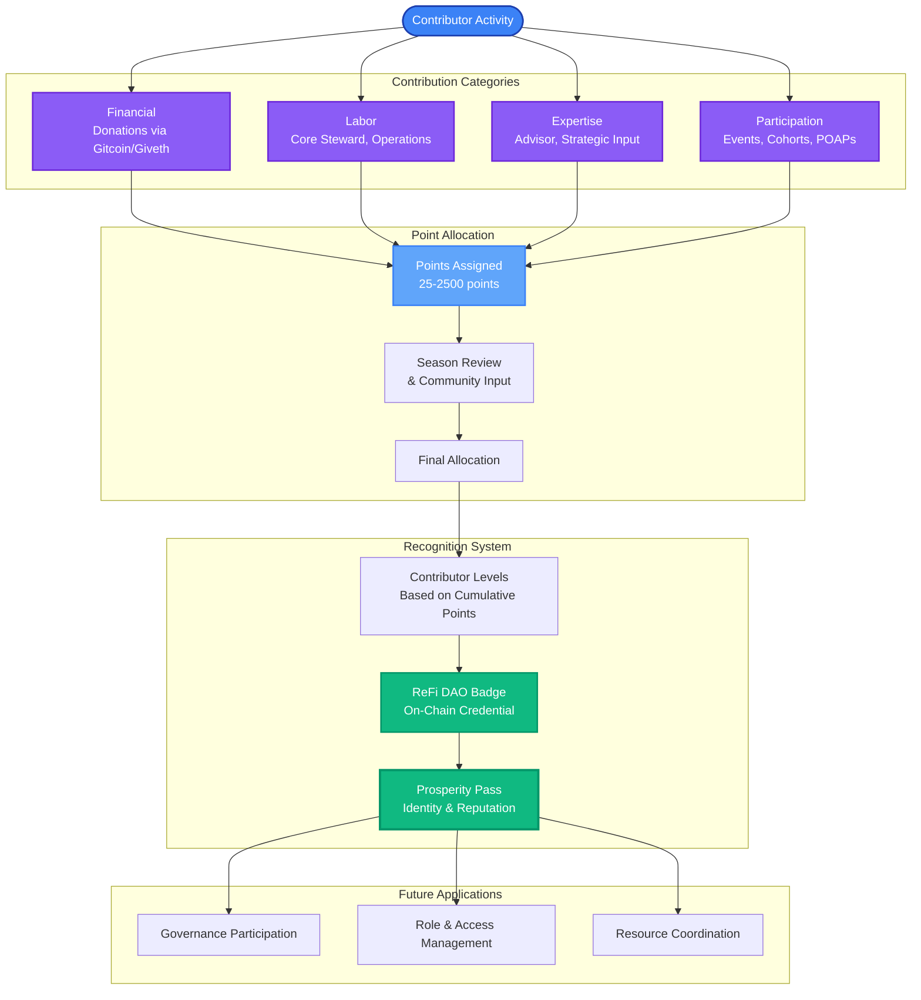

# ReFi DAO Reputation - Contribution Points Documentation

# Overview

## **ReFi DAO Contribution Points**

The ReFi DAO Contribution Points system is a flexible framework for tracking contributions to ReFi DAO over time, providing a broad understanding of who contributes, in what ways, and when. Contributions can take many forms, such as serving as a ReFi DAO Core Steward, writing for the ReFi DAO blog, hosting or appearing on the ReFi Podcast, participating in Founders Circles, making financial donations, and much more. 

At its core, the system is about recognizing and celebrating those who actively advance ReFi DAO’s mission and core activities. While the system assigns points to each contributor, the goal is not to focus on the exact number of points but to ensure a broadly fair representation of meaningful engagement and active participation. By assigning **Contributor Levels** based on cumulative contributions, the system provides a simple yet effective way to highlight and recognise efforts across roles and initiatives.

This framework is designed to evolve, with the flexibility to add new categories, refine metrics, and capture a broader spectrum of contributions. Ultimately, it enables ReFi DAO to track and celebrate contributions while focusing on the larger vision: building a thriving, collaborative, and impactful global community to advance the ReFi movement.

## **Integration with Prosperity Pass**

A key innovation linked to this system is its integration with the **Prosperity Pass**, an on-chain identity and reputation platform launching in January 2025. The Prosperity Pass will feature badges linked with the Celo and ReFi ecosystem, including the ReFi DAO Badge, which recognizes key contributors based on the data from the Contribution Points system and enabling contributors to "level up" their badge as they continue to engage with ReFi DAO. This integration provides an on-chain credential that highlights an individual's contribution to ReFi DAO.

## Contribution Points System Flow

Beyond tracking and recognition, this system holds potential to support ReFi DAO 2.0 governance, role and access management, and the coordination of people and resources. Co-creating the future development of **Prosperity Pass,** we envision the potential of expanding the system for Local Node communities, offering a comprehensive view of global reach and impact. By leveraging the Prosperity Pass’s high-quality on-chain data, we can create a robust and transparent mechanism for capturing, celebrating, and scaling the incredible contributions of our community.

## 👇                                          👇                                             👇

# Technical Details & Documentation

## Overview

The ReFi DAO Contribution Points system is built on Airtable, integrating data from multiple sources such as the ReFi Knowledge Graph, on-chain data (e.g., Gitcoin, Giveth, POAPs), and other community-driven inputs. This infrastructure enables ReFi DAO to categorize, record, and reward contributions across various initiatives and timeframes.

This section outlines the key technical details of how the system works, including the types of contributions it tracks, how seasons are defined, and the processes for reviewing and allocating points.

## **Contribution Types**

Contributions are categorized into four main types, reflecting the diverse ways individuals support ReFi DAO:

1. **Financial Contributions:** Contributions in the form of direct financial support, such as donations through Gitcoin or Giveth.
2. **Labor:** Time and effort invested in ReFi DAO initiatives, such as core stewardship, project management, or operational roles.
3. **Expertise:** Contributions of knowledge, advice, or network connections, typically provided by advisors or specialists. These contributions often require little time but deliver high strategic value.
4. **Participation:** Engagement through active involvement in ReFi DAO programs and initiatives, such as attending events, workshops, or participating in cohorts.

## **Seasons**

Seasons are used to organize and review contributions over time, creating a clear framework for tracking efforts across specific periods. Each season captures a distinct phase of ReFi DAO’s evolution, whether foundational, ongoing, or future-focused.

1. **Legacy Season:** Covers the foundational phase of ReFi DAO (pre-2024) up to the [Leadership Transition](https://blog.refidao.com/a-leadership-transition-at-refi-dao-paving-the-way-for-new-growth/) during ReFi Week. Contributions during this phase have been retrospectively reviewed and categorized.
2. **Annual Seasons (2024, 2025, etc.):** Each calendar year represents a distinct season for tracking and reviewing contributions made within that timeframe.

## Levels

- Levels

## **Contribution Domains & Categories**

| **Domain** | **Category** | **Contribution Type** | **What (Description)** | **Seasons** | **Points Allocation Methodology** |
| --- | --- | --- | --- | --- | --- |
| **ReFi DAO Global** | **Core Steward** |  | Contributions during time spent as a ReFi DAO Global Core Steward. | **Legacy, 2024** | 500-2500 points |
| **ReFi DAO Global** | **Core Contributor & Advisor** |  | Contributions during time spent as a ReFi DAO Global Core Contributor or Advisor. | **Legacy, 2024** | 50-500 points |
| **Network Initiatives** | **Blog Writer** |  | Writing & editing contributions to the ReFi DAO Blog. | **Legacy, 2024** | 50-500 points |
| **Network Initiatives** | **ReFi Podcast Host** |  | Hosting the ReFi Podcast, moderating discussions, inviting guests, etc. | **Legacy, 2024** | 250-500 points |
| **Network Initiatives** | **ReFi Podcast Guest** |  | Appearing as a guest on the ReFi Podcast to share insights, experiences, or expertise. | **Legacy, 2024** | 75 points |
| **Network Initiatives** | **ReFi Podcast Collector** |  | Collecting ReFi Podcast episodes ([https://pods.media/refi-podcast](https://pods.media/refi-podcast)). | **2024** | 25 points |
| **Network Initiatives** | **Founders Circle Catalyst**  |  | Serving as a steward for ReFi DAO Founders Circles (cohort 0, 1, or 2). | **Legacy** | 50-100 points |
| **Network Initiatives** | **Founders Circle Participant** |  | Participating in ReFi DAO Founders Circles (cohort 0, 1, or 2). | **Legacy** | 50 points |
| **Network Initiatives** | **ReFi Spring** |  | Stewarding and contributing to ReFi Spring. | **Legacy** | 25 points |
| **Local Nodes** | **Local Node Cohort Participant** |  | Participating in Local Node cohort programs (Alpha, Beta, Regen Coordination Retro - Cohort 0). | **Legacy, 2024** | 100-150 points |
| **Community** | **Financial Contributor** |  | Capital contributions to ReFi DAO (e.g. via Gitcoin, Giveth, etc.). | **Legacy, 2024** | 50, 75, or 100 points per season depending on size of contribution.  |
| **Community** | **POAP Collector** |  | Collecting official ReFi DAO Event POAPs ([https://collections.poap.xyz/refi-dao/3912?tab=collectors](https://collections.poap.xyz/refi-dao/3912?tab=collectors)). | **Legacy, 2024** | 25 points |

## **Processes & Governance**

To ensure fair and transparent contribution tracking, each season follows a review and allocation process, seeking collaborative community input to ensure broad alignment on the results:

1. **Contribution Categories:** As new contributions emerge during the season, core stewards update the Contribution Categories table to reflect these developments. These updates are posted in the Charmverse forum, where ReFi DAO Global members can review, provide feedback, and propose changes or additions.
2. **End-of-Season Allocation:** At the end of each season, core stewards review contributions, consolidate data, and create a preliminary points allocation. This initial allocation, along with updated contribution categories, is shared with ReFi DAO Global members for any feedback and input. After incorporating revisions, the final results are published.

## **Conclusion**

The ReFi DAO Contribution Points system is a vital tool for recognizing, celebrating, and tracking the diverse contributions that drive our mission forward. By fostering transparency, collaboration, and inclusivity, this system aims to ensure that every contributor’s efforts are valued and reflected in meaningful ways.

As we continue to iterate and refine this framework, we invite the community to engage actively—sharing feedback, proposing improvements, and shaping its evolution. Together, we can build a robust, adaptive system that not only supports ReFi DAO’s growth but also strengthens the global ReFi movement.