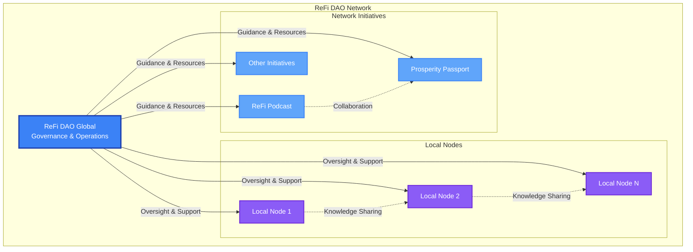
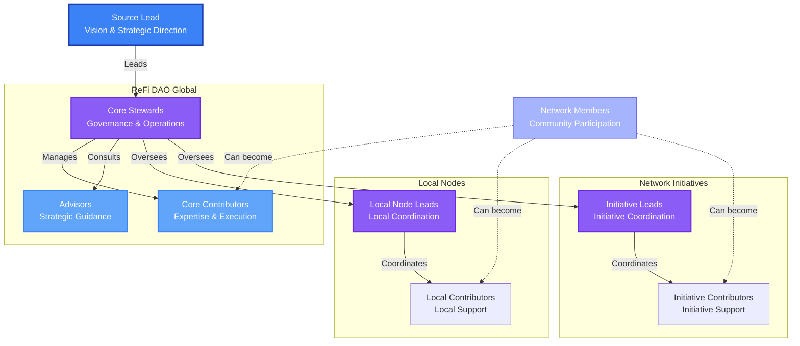
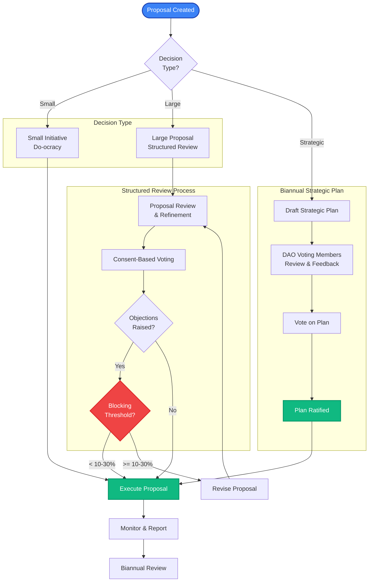

# ReFi DAO Network - Structure, Roles, & Governance

## Network Structure Overview

# 1. Network Structure & Roles

ReFi DAO operates with a decentralized yet coordinated structure, balancing autonomy with alignment to the network’s broader mission, vision, and values. At the core, ReFi DAO Global serves as the governance and operational body, overseeing strategic planning, financial management, and network-wide coordination. Meanwhile, Local Nodes and Network Initiatives maintain their autonomy, while aligned and contributing to the overarching vision and mission of the DAO. Each role within the DAO, from Core Stewards to Contributors and Supporting Members, has clearly defined responsibilities and active participation in governance when necessary. This structure allows for diverse initiatives to flourish while ensuring cohesive progress towards ReFi DAO’s collective vision and mission.

## 1.1 ReFi DAO Network

**ReFi DAO is a network** that operates across multiple levels from global to local. The organizational structure of the network combines decentralized autonomy with clear structure, connectivity, and a collective mission, vision, values, identity. This aims to allow for diverse initiatives to flourish while ensuring alignment and integration with the broader mission and values of ReFi DAO.  

### 1.1.1 ****Role - **Network Members**

**Network Members** signal alignment with ReFi DAO’s vision, mission, and values by singing the [**ReFi DAO Community Covenant**](https://claim.hatsprotocol.xyz/42220/13.3.1). This entry-level membership empowers access to basic resources, participation in discussions and opportunities to contribute.

- **Wearers:**
    - **Signal Alignment:** Prospective Supporting Members signal their alignment by signing ReFi DAO’s [**Community Covenant**](https://claim.hatsprotocol.xyz/42220/13.3.1) using their wallet.
    - **Access to Resources:** After onboarding, Network Members gain access to basic resources and community engagement tools, such as Charmverse forums and updates.
- **Key Responsibilities:**
    - **Mission Alignment:** Commit to supporting ReFi DAO’s mission, values, and vision.
    - **Financial Support:** Contribute to ReFi DAO’s sustainability by donating through platforms such as Giveth or Gitcoin, helping fund ongoing projects and operations.
    - **Community Engagement:** Participate in discussions, stay informed about initiatives, and provide feedback where applicable.
    - **Opportunity for Active Contribution:** Supporting Members may transition into more active roles as they become more involved.

## 1.2 ReFi DAO Global

**ReFi DAO Global** is the core coordination and governance body for the **ReFi DAO Network**. It facilitates the creation of key high-level documentation and strategic plans to be ratified by governance. From there, it is responsible for network level financial management and execution of core operations, as well as providing support and oversight to various local and thematic initiatives while empowering them to operate autonomously.

- **Key Responsibilities:**
    - **Operational Leadership:** Oversee and drive day-to-day operations of the DAO, ensuring that decisions and actions are executed in line with the strategic plans ratified by the DAO’s governance.
    - **Network Oversight and Support:** Provide guidance, resources, and oversight to connected Local Nodes and Network Initiatives, ensuring their autonomy while aligning them with the global mission.
    - **Mission and Strategic Alignment:** Safeguard the integrity of the network’s mission, values, and long-term strategy, ensuring that all activities and initiatives support these principles.
    - **Governance and Policy Development:** Lead the creation and ongoing refinement of high-level governance documents, such as the DAO’s charter, policies, and decision-making frameworks, ensuring they are up-to-date, adhered to, and accurately reflect the needs of the network.
    - **Financial Stewardship:** Manage the network’s financial resources, ensuring the effective allocation of funds to support both global and local initiatives while maintaining transparency and accountability.
    - **Coordination of Core Operations:** Ensure the seamless execution of core network operations, including communication, project management, and strategic execution, to maintain cohesion across the DAO.

### Roles

## Roles and Responsibilities Hierarchy

### 1.2**.1 Core Stewards**

**Core Stewards** serve as key facilitators and operatives for the DAO. They are responsible for nurturing the growth and progress of the network by supporting the development and execution of strategic plans in accordance with the directions ratified by the DAO. Core Stewards play a pivotal role in both governance and the financial stewardship of ReFi DAO, ensuring the smooth operation and sustainability of the network.

- **Key Responsibilities:**
    - **Strategic Participation:** Engage actively in ReFi DAO calls and discussions, offering valuable insights, feedback, and strategic direction to help shape the network’s future.
    - **Proposal Review and Assessment:** Evaluate and provide feedback on proposals and propositions from Local Nodes and Network Initiatives, ensuring alignment with ReFi DAO’s mission, values, and strategic focus. Alongside similar input from other roles and stakeholder groups.
    - **Initiative Development:** Support the development and execution of initiatives that contribute to the success and growth of the DAO, fostering a culture of innovation and collaboration within the network.
    - **Governance and Accountability:** Ensure transparency in core steward decision-making processes, maintain accountability to the broader DAO community, and report regularly on progress, challenges, and strategic developments.
    - **Financial Stewardship:** Oversee and manage the financial operations of ReFi DAO Global, including approving budget requests, allocating resources, and ensuring timely payments to contributors. This is done in accordance with the strategic plans and directions ratified by the DAO.
    - **Representation and Advocacy:** Represent ReFi DAO Global at external events, conferences, and in partnerships, advocating for the network’s mission and building strategic relationships that benefit the organization.
    - **Continuous Learning:** Stay informed about emerging trends, best practices, and developments within regenerative finance and decentralized governance, and integrate new insights to guide the evolution of the network.

### 1.2**.2 Source Lead**

The **Source Lead** is deeply involved in crafting the overarching vision for ReFi DAO, guiding the network’s strategic direction and building alignment. The Source Lead collaborates closely with the Core Stewards to lead core operations.

- **Inspiration**: Source Work
    - Peter Koenig - *the* *role of source.*
    - [*Tom Nixon - Work with Source*](https://tomnixon.medium.com/work-with-source-realise-big-ideas-organise-for-emergence-and-work-artfully-with-money-ee009ba6d843)
    
    Based on the work of Peter Koenig who developed a new lens, a way of seeing human initiatives. Central to this was focussing not on organisations but on the underlying creative process of realising ideas, and acknowledging the special authorship and responsibility of one individual stewarding the process — what Koenig called *the* *role of source.*
    
    Building on these insights over many years, Koenig clarified some seemingly timeless, fundamental dynamics that all human initiatives, from activist campaigns to companies and creative projects, appear to have in common. His “Source Principles” help us understand why some visions are realised while others fizzle out and offer clues as to how we might intervene when things are not working. Working with source is about:
    
    - recognising the natural, potent role that founders and their successors play in realising a vision, yet without hero worship, subservience, or tyranny
    - bringing forth the full creative potential of everyone, not only those seen as *leaders*
    - creating not only a happy community of colleagues but a sustained focus on realising a vision
    - embracing complexity but not drowning in it
    - working both top down and bottom up simultaneously
    - working artfully with money in service of the vision, so we neither cling to nor repel it
    - maintaining a participatory way of working over the long term
    
    Nothing starts without a founder, but here’s the great paradox: to grow a collective endeavour, it can’t just be about the founder. We have to decentralise, yet at the same time, founders and their successors have a natural authorship and vital role to play in endeavours they start. A founder failing to show up well can be the undoing of everything, but get it right and a purposeful vision can come to life spectacularly.
    
    https://tomnixon.medium.com/work-with-source-realise-big-ideas-organise-for-emergence-and-work-artfully-with-money-ee009ba6d843
    
    [Work with Source: Realise big ideas, organise for emergence and work artfully with money](https://tomnixon.medium.com/work-with-source-realise-big-ideas-organise-for-emergence-and-work-artfully-with-money-ee009ba6d843)
    
- **Key Responsibilities:**
    - **Vision Stewardship:** Lead the articulation and continuous evolution of ReFi DAO’s mission, while building alignment across all Local Nodes and Network Initiatives.
    - **Strategic Planning:** Lead the creation of strategic plans in collaboration with Core Stewards and network participants, while ensuring they reflect the collective goals and values of the DAO.
    - **Core Stewards Formation and Curation:** Lead the formation, curation, and ongoing development of the Core Stewards group, ensuring it remains aligned with the DAO’s mission and supports the broader network’s health and growth.
    - **Resource Allocation:** Lead the distribution of financial, human, and intellectual resources to initiatives that best align with ReFi DAO’s goals, ensuring effective use of the DAO’s assets.
    - **Operations Oversight:** Ensure the smooth execution of ReFi DAO’s day-to-day operations by coordinating efforts between Core Stewards, Contributors, and Initiative Leads.
    - **Community Engagement:** Foster a strong participatory culture within the network, encouraging active engagement, collaboration, and inclusivity among all members.
    - **Governance and Accountability:** Work with the Core Stewards to ensure transparent decision-making, adherence to governance protocols, and accountability to the broader community.
    - **Succession Planning:** Identify and mentor potential successors or deputies to ensure a smooth leadership transition in the future, maintaining the long-term continuity of the DAO’s vision and values.

### 1.2**.3 Core Contributors**

**Core Contributors** are active members of ReFi DAO Global who bring specific expertise, operational support, or collaborate on strategic projects and initiatives. Their contributions may vary over time depending on the needs of the DAO and the nature of the projects they are involved in. Core Contributors play an essential role in executing initiatives that drive the mission of ReFi DAO forward.

- **Key Responsibilities:**
    - **Active Contribution:** Contribute to specific areas of the DAO’s work based on their expertise, whether it be design, marketing, operational support, or other domains critical to the network’s success.
    - **Governance**: Participate in network governance as and when makes sense.
    - **Project Execution:** Take ownership of tasks and initiatives relevant to their expertise, ensuring projects are delivered on time and meet ReFi DAO’s goals and standards.
    - **Collaboration:** Collaborate with Core Stewards, other Contributors, and Initiative Leads to ensure effective coordination and seamless execution of projects.
    - **Adaptability:** Be flexible and ready to support evolving needs of the DAO, adapting to new priorities and contributing to different projects as needed.
    - **Knowledge Sharing:** Share insights, learnings, and best practices with the broader DAO community to foster continuous improvement and collective growth.
    - **Accountability:** Take responsibility for delivering on commitments and maintaining transparent communication regarding project status, challenges, and outcomes.
    - **Community Engagement:** Actively participate in relevant meetings and discussions, offering input, feedback, and expertise where needed to support the broader mission of ReFi DAO.

### 1.2**.4 Advisors**

**Advisors** are trusted community members who provide strategic advice and guidance on an as-needed basis. Advisors offer insights based on their expertise but do not hold operational responsibilities.

- **Key Responsibilities:**
    - **Strategic Input:** Provide occasional strategic advice on initiatives and direction when consulted.
    - **Voluntary Engagement:** Stay connected to the community and offer guidance on key issues.
    - **Compensated Engagement:** For deeper involvement, compensation can be arranged based on the needs of the initiative and Advisor’s availability.
    - **Governance**: Participate in ReFi DAO network governance as and when makes sense.

## 1.3 **ReFi Local Nodes**

**ReFi Local Nodes** are autonomous, place-based communities that experiment with, implement, and innovate regenerative finance (ReFi) in their respective regions. These nodes are self-governing, while maintaining alignment with the broader mission, values, and charter of ReFi DAO.

- **Key Responsibilities**
    - **Mission Alignment:** Ensure all activities, projects, and partnerships within the Local Node are aligned with ReFi DAO’s overarching mission, values, and identity, contributing to the global vision of regenerative finance.
    - **Autonomous Governance:** Exercise autonomy in governing local projects and initiatives, while adhering to the network-level principles, charter, and governance framework set by ReFi DAO Global.
    - **Participation in Network Governance:** While operating autonomously, Local Nodes are encouraged to participate in ReFi DAO Global governance processes, providing input on key decisions that affect the broader network. This includes participating in DAO votes and network-wide consultations.
    - **Transparent Financial Management:** Maintain transparent financial practices, ensuring all incoming and outgoing funds are tracked and reported. Share periodic financial reports with ReFi DAO Global to ensure accountability and alignment with broader network goals.
    - **Impact Reporting:** Regularly report on key activities, milestones, and impact within the Local Node. Provide metrics and qualitative feedback to demonstrate the tangible effects of local experimentation and implementation, contributing to ReFi DAO’s overall success.
    - **Collaboration and Knowledge Sharing:** Engage with other Local Nodes and ReFi DAO Global to share insights, lessons, and best practices, fostering a culture of learning and collective progress across the network.

### Roles

### 1.3.1 **Leads**

**Local Node Leads** are responsible for forming the unique vision, strategy, and focus of their node, and coordinating activities accordingly. They ensure that the projects, initiatives, and collaborations of the Local Node align with this vision as well as the broader mission and values of ReFi DAO. Their responsibilities to the wider ReFi DAO network encompass knowledge sharing and the reporting of key activities and impact, see **[**Key Responsibilities**](ReFi%20DAO%20Network%20-%20Structure,%20Roles,%20&%20Governance%202062e7251f2f80219df3d996d1a95ea1.md).**

### 1.3.2 **Contributors**

**Contributors** within Local Nodes provide expertise, resources, and hands-on support to help execute local node initiatives. Contributors actively collaborate with the Leads and other members, sharing knowledge and skills to help drive the success of the local ReFi ecosystem. Their participation contributes to the broader impact and learning of the global network.

### 1.3.3 Partners & Participants

**Partners & Participants** are individuals who live locally within the region of a Local Node and actively participate in node activities or programs. While they may not be directly involved in the coordination or execution of local node initiatives, they are integral members of the community. Supporting Members contribute to the vibrancy of the Local Node by attending events, engaging in discussions, and supporting the broader mission of ReFi DAO. Their participation helps strengthen the local ReFi ecosystem and fosters community engagement, providing a foundation for more active involvement if desired in the future.

- May also separate ‘Local Supporting Members’ and then also track additional supporting members that may not be local. e.g. could track all on-chain addresses that have donated to the Local Node on Gitcoin or Giveth.

## 1.4 Network **Initiatives**

**Network Initiatives** are autonomous projects, guilds, or working groups that align with the mission, vision, values, and identity of ReFi DAO. These initiatives operate independently with their own teams, resources, and structures, while maintaining coherence with the broader network's goals and brand identity. They may also receive financial support and guidance from ReFi DAO Global. 

- **Examples include:**
    - **ReFi Podcast**: A media initiative that shares knowledge, interviews, and insights from the regenerative finance space.
    - **ReFi EBF**: Initiative focused on the Ecological Benefits Framework (EBF) and fostering partnerships within the ReFi community.
    - **Prosperity Passport Development**: Development of a product to support Web3 identity in the Celo and ReFi economy.
- **Key Responsibilities:**
    - **Mission Alignment:** Ensure activities and projects remain aligned with ReFi DAO’s mission, vision, and values, contributing meaningfully to the overall success and visibility of the network.
    - **Collaborative Autonomy:** Operate with a degree of independence, managing resources and operations in a way that reflects the initiative's unique focus, while maintaining open communication with ReFi DAO Global. Initiatives may choose to collaborate closely with ReFi DAO Global on shared goals or strategies when appropriate.
    - **Governance Participation:** Primarily engage in ReFi DAO’s governance processes when decisions directly impact the initiative’s activities. However, initiatives also have the opportunity to provide input on broader strategic decisions and participate in DAO-wide votes if they choose, ensuring their voice is heard in shaping the future of the network.
    - **Transparency and Accountability:** Maintain transparency in financial and operational reporting, including sharing periodic updates on progress, impact, and resource utilization with ReFi DAO Global to ensure alignment and mutual accountability across the network.
    - **Knowledge Sharing and Contribution:** Share learnings, best practices, and innovations with the broader ReFi DAO community to foster collective growth, collaboration, and continuous improvement within the network.

### Roles

### 1.4.1 **Leads**

**Initiative Leads** are responsible for forming and executing the unique vision, strategy, and focus of their initiative, ensuring alignment with both the initiative’s goals and the broader ReFi DAO mission. They oversee the coordination of activities, project execution, and strategic partnerships within the initiative.

- **Responsibilities:**
    - **Vision and Strategy Formation:** Lead the creation and evolution of the initiative’s vision and strategic direction, ensuring coherence with ReFi DAO’s mission and values.
    - **Project Management:** Oversee and manage the execution of key projects within the initiative, ensuring timely delivery and quality outcomes.
    - **Collaboration and Alignment:** Act as the primary liaison between the initiative and ReFi DAO Global, ensuring alignment with the broader network while fostering collaboration with Local Nodes or other initiatives.
    - **Impact and Reporting:** Ensure transparent reporting of key activities, financial management, and impact metrics to ReFi DAO Global.

### 1.4.2 **Contributors**

**Contributors** to Network Initiatives provide expertise, resources, and operational support, playing a vital role in advancing the initiative’s goals. They work collaboratively with the Leads and other contributors to execute projects and drive innovation.

- **Responsibilities:**
    - **Project Execution:** Actively participate in and contribute to the successful execution of projects within the initiative.
    - **Collaboration and Knowledge Sharing:** Engage with other contributors and Leads to foster a collaborative working environment, sharing knowledge and best practices to enhance the initiative’s impact.
    - **Alignment with Mission:** Ensure that their contributions and efforts are in line with ReFi DAO’s mission and values, helping the initiative achieve meaningful outcomes.

### 1.4.3 Partners & Participants

**Partners & Participants** are individuals who offer their participation or financial support to the initiative. Advisors provide strategic guidance, while Supporting Members contribute through engagement in activities or by providing donations to support the initiative’s goals.

- **Responsibilities:**
    - **Strategic Guidance (Advisors):** Offer occasional insights, advice, or recommendations based on their expertise, helping the initiative stay aligned with its objectives and the broader ReFi DAO mission.
    - **Community Participation (Supporting Members):** Actively engage in initiative-related events, discussions, or programs, contributing to the success and vibrancy of the initiative.
    - **Financial Support:** Contribute to the initiative’s sustainability by donating through platforms such as Giveth or Gitcoin, helping fund ongoing projects and operations.
    - **Knowledge and Resource Sharing:** Support the initiative by offering valuable knowledge, resources, or networks that can enhance its impact and effectiveness.

## **1.5 On-Chain Reputation**

To support transparency, recognition, and coordination across our growing network, ReFi DAO uses a **Contribution Points** system to track and celebrate meaningful engagement across all roles and initiatives. Whether you’re hosting a podcast, writing for the blog, stewarding a Local Node, donating on Gitcoin, or joining a Founders Circle, you can earn points that reflect your contributions across financial, labor, expertise, and participation domains. These points feed into **Contributor Levels**, helping recognize sustained and active involvement.

These contributions are also integrated into the [**Prosperity Pass**](https://pass.celopg.eco/welcome), an on-chain identity and reputation system. Your activity earns you your **ReFi DAO Badge** that evolves as you engage—offering a transparent, verifiable record of your role in building this regenerative network society.

This system not only celebrates contributors, but also lays the groundwork for future governance participation, role access, and resource coordination within ReFi DAO 2.0.

Learn more here: [ReFi DAO Contribution Points Documentation](https://www.regencoordination.xyz/ReFi-DAO-Reputation-Contribution-Points-Documentation-2082e7251f2f80a9be95f674baa25646)

**Check role👇**

**View Hats 👇**

**Build Reputation👇**

---

# 2. Governance

ReFi DAO's governance framework aims to balance decentralized autonomy with coordinated oversight, empowering **ReFi Local Nodes** and **Network Initiatives** to operate independently while ensuring alignment with the DAO's mission, vision, and values. The **Biannual Retrospective & Strategic Plan** guide the next six months, outlining key objectives, priorities, resource allocations, and roles, ensuring accountability and adaptability as the DAO evolves. To enable agile decision-making, ReFi DAO uses an **optimistic and consent-based governance system**, allowing proposals to move forward unless significant objections arise. Smaller initiatives can proceed autonomously through a **do-ocracy** approach, while larger proposals follow a structured review process, with accountability measures tracking milestones and ensuring transparency. This regenerative governance model aims to foster active participation, shared learning, and alignment with long-term goals, keeping ReFi DAO dynamic, transparent, and mission-driven.

## Governance Flow

### **2.1 ReFi Local Nodes & Network Initiatives**

As long as they align with the broader ReFi DAO mission, values, and future charter (TBD), **ReFi Local Nodes,** and Network Initiatives like the **ReFi Podcast,** operate autonomously. These initiatives have control in decision-making and execution, provided their actions remain consistent with the shared goals, values, and agreements of the ReFi DAO network.

https://hub.greenpill.network/t/starting-a-refi-local-node-in-your-community/236

https://hub.greenpill.network/t/starting-a-refi-dao-network-initiative/237

### 2.2 Network **Governance Foundations**

### **2.2.1 The Androgynous Organisation (T.A.O.)**

### **2.2.1 Optimistic and Consent-Based Governance**

**Optimistic governance** and **consent-based voting systems** are decentralized decision-making models that focus on minimizing friction in governance processes while ensuring inclusivity and safeguarding against harmful decisions. These systems are designed to streamline decision-making by prioritizing action and allowing decisions to move forward unless there is significant opposition.

- **Optimistic Governance**:
    1. **Default to Action**: In optimistic governance, decisions are assumed to be approved unless an objection is raised. This "default yes" approach allows the organization to move quickly and encourages experimentation and evolution. If there are no substantial objections within a specified period, the proposal is enacted.
    2. **Empowerment through Trust**: The system is built on trust, where contributors are trusted to act in the best interest of the community. The goal is to reduce unnecessary debates or bureaucratic barriers to decision-making.
    3. **Objections vs. Consensus**: Instead of needing a majority to pass a proposal, the emphasis is on **raising objections**. If someone believes a proposal isn't "safe enough to try" or needs refinement, they can voice concerns. The process focuses on overcoming objections rather than achieving complete agreement.
    4. **Agility and Iteration**: Since decisions can be enacted quickly, the system encourages iterative progress. If a decision doesn’t work, it can be revisited, refined, or reversed without much friction.
- **Consent-Based Voting Systems**:
    1. **Consent vs. Consensus**: In consent-based voting, the aim isn’t to achieve unanimous agreement but to ensure that no one has serious objections. The standard is “**good enough for now, safe enough to try**,” meaning that a proposal doesn’t need to be perfect, just workable and non-harmful. Objections must be based on specific concerns, such as potential harm or misalignment with the organization's mission.
    2. **Roles in Decision-Making**:
        - **Proposer**: Puts forward a proposal that is shared with the relevant community.
        - **Responders**: Members who review the proposal can either raise objections or give consent.
        - **Objectors**: If there are objections, these must be clearly articulated, and ideally, solutions or amendments should be proposed to address the concerns.
    3. **Structured Feedback**: Feedback is encouraged to improve proposals, and the process allows for collaboration. Objections must be accompanied by reasoning and an alternative solution or adjustment.
    4. **Gradients of Agreement**: Some consent-based systems implement a gradient of responses beyond just “approve” or “reject.” For example:
        - Full support.
        - Support with minor reservations.
        - Abstain.
        - Objection, but willing to move forward.
        - Block the proposal with strong objection (rarely used).
- **Best Practices for Optimistic and Consent-Based Governance**:
    1. **Clear Proposal Process**: Establish clear guidelines for submitting proposals. Include timeframes for how long proposals are open for review, voting, or objections (e.g., 1-2 weeks).
    2. **Transparency and Documentation**: Ensure that all proposals, discussions, objections, and decisions are well-documented and accessible to the community. This helps maintain trust and provides a historical record of decisions.
    3. **Defined Criteria for Objections**: Make it clear what qualifies as a valid objection. Objections should be grounded in concrete concerns related to harm, misalignment with mission/values, or feasibility issues.
    4. **Encourage Constructive Participation**: Encourage community members to propose alternatives or refinements when they raise objections. This fosters collaboration and prevents blocking without reason.
    5. **Iterative Feedback Loops**: Use regular reviews or retrospectives to evaluate how well decisions are working in practice. Allow flexibility for revisiting decisions if necessary.
    6. **Review Mechanisms**: Implement regular reviews or audits of major decisions and actions to ensure ongoing alignment with the DAO's mission and long-term goals.
    7. **Facilitation Role**: Consider designating a **Facilitator** or **Driver** who can help guide the process, ensure deadlines are respected, and encourage constructive engagement.
- **Advantages:**
    - **Efficiency**: Moves decisions forward without needing full consensus.
    - **Inclusivity**: Ensures objections are heard and addressed, fostering a sense of inclusion.
    - **Agility**: Decisions are made quickly, allowing for faster progress and iteration.
- **Challenges:**
    - **Objections Management**: If not managed well, objections can stall the process. Defining clear criteria and structured engagement helps mitigate this.
    - **Trust Dependency**: Optimistic governance works best in communities with a high level of trust among participants.

Adopting this model for ReFi DAO, we aim to foster both agility and inclusivity in decision-making.

### **2.2.2 DACI Decision-Making Framework**

The **DACI decision-making framework** is a structured approach for decision-making that helps clarify roles and responsibilities in group settings, ensuring accountability and efficiency. The acronym DACI stands for:

1. **D - Driver**: The person responsible for driving the decision-making process forward. They organize discussions, gather input, and ensure that the process moves along. The Driver may not make the final decision but ensures that it happens.
2. **A - Approver**: The person (or group) who has the authority to make the final decision. This individual or entity takes accountability for the decision and its outcomes.
3. **C - Contributor**: Individuals or groups who provide input, expertise, or data to inform the decision. Contributors don't have the final say but play a crucial role in offering valuable perspectives and information.
4. **I - Informed**: People who are informed about the decision after it has been made. They don’t contribute directly to the decision-making process but need to know the outcome because it affects their work or responsibilities.

### How DACI Works

- The **Driver** coordinates the process by consulting with **Contributors**, collects all necessary information, and brings everything to the **Approver**, who makes the final decision.
- Once the decision is made, the **Informed** parties are updated.

DACI is useful for avoiding confusion in group decision-making as it clarifies who holds responsibility at each stage of the process.

### 2.3 Network **Governance In-Practice**

### 2.3.1 Biannual Strategic Plans & High-Level Changes

The **Biannual Strategic Plans** are central guiding documents for ReFi DAO, serving as a roadmap for the next six months and a mandate for Core Stewards and Contributors to execute their roles and responsibilities. The plans are designed to foster alignment, transparency, and collective action, ensuring that ReFi DAO's initiatives are mission-driven and accountable. This approach empowers Core Stewards to make everyday decisions, while keeping the network’s strategic goals aligned with those ratified by the DAO.

- **Each plan will include items such as:**
    - **Key High-Level Objectives**: The major goals that ReFi DAO aims to achieve within the six-month period.
    - **Priorities**: A ranked set of focus areas for the DAO to guide resource allocation and decision-making.
    - **Roles**: Review and update of roles and responsibilities for Core Stewards, Initiative Leads, and Local Node Leads, among others.
        - This includes an assessment of each role’s contribution in the previous six months. Members who were inactive or did not contribute will be offboarded to allow space for new participants.
    - **Resource Allocation**: Allocation of financial, human, and intellectual resources / high-level budgeting across different initiatives and projects.
    - **Reference or Revision of Mission, Vision, Values**: Ensure alignment with the DAO’s mission, vision, and value charter to ensure the network remains focused on its overarching purpose or seek to make key revisions.
    - **Financial & Impact Accounting**: A core component of the plan, focusing on the financial management of the DAO and tracking of impact metrics across local and global initiatives.
    - **Overall ReFi DAO Reflections**:
        - **Outcome Assessment**: Are we achieving the outcomes we set? If not, why?
        - **Continuous Improvement**: What adjustments or changes do we need to make? How can we update the strategy to meet evolving needs?

In alignment with **regenerative organizational design principles**, the Biannual Strategic Planning cycle aims to recognise that everything in nature follows cycles of **life, growth, decay, and renewal**. As such, it is important that initiatives, projects, and even roles follow this natural cycle. The **Biannual Strategic Plans** play a critical role in this process by resetting the focus on which projects, initiatives, and roles are prioritized, while allowing others that no longer serve the collective mission to "compost" if they are not renewed.

Additionally, the strategic plan will include a review of **Core Stewards, Core Contributors, and Advisors** to ensure that members remain actively engaged and aligned with the network’s goals. For example, if members have not been active in the past half-year, they will be naturally offboarded during these review periods, allowing for the organic renewal of leadership and participation. This ensures that the DAO remains dynamic, adaptable, and aligned with the evolving needs of the network, creating space for new ideas, leaders, and initiatives to emerge.

### **Formation and Ratification Process**

- **1. Proposal Creation Phase (Drafting the Strategic Plan)**
    - **Drivers**: Source Lead and Core Stewards
    - **Input from Contributors**: Local Node Leads, Network Initiative Leads, and other Contributors provide insights on their local or thematic priorities to inform the plan.
- **2. Proposal Review & Refinement Phase (Open for Feedback)**
    - **DAO Voting Members Review**: The draft plan is shared with all **DAO Voting Members** (Core Stewards, Core Contributors, Advisors, Local Node Leads, Network Initiative Leads) for review and feedback.
    - **Contributors**: Supporting Members and other stakeholders are also invited to provide input and raise feedback during this period.
    - **Consensus Building**: The focus is on ensuring the plan is "good enough for now, safe enough to try" while addressing any major objections that could prevent the plan's successful execution in the Voting Phase.
        - Any objections should focus on alignment issues, feasibility concerns, or potential harm, and should include suggestions for improvement.
        - Constructive feedback is encouraged to ensure the plan is both practical and impactful.
- **3. Voting Phase (Consent-Based Voting)**
    - After refinement, the final version of the strategic plan is submitted for a consent-based vote.
    - **Approvers**: DAO Voting Members (Core Stewards, Core Contributors, Advisors, Local Node Leads, Network Initiative Leads)
        - **Voting Options**:
            - **Full consent** (support the plan).
            - **Consent with reservations** (minor concerns, but willing to move forward).
            - **Object** (strong objection seeking further revision).
            - or could use:
                - Full support.
                - Support with minor reservations.
                - Abstain.
                - Objection, but willing to move forward.
                - Block the proposal with strong objection (rarely used).
    - The proposal is **blocked** if a certain percentage of Voting Members (e.g., **10-30%** of the total group) vote **Object** to the plan.
    - **Voting Period**: The voting process typically lasts 7 days.  If no strong objections are raised, the plan is ratified.
- **4. Ratification and Communication Phase**
    - **Plan Ratified**: If no blocking objection threshold is reached, the Biannual Strategic Plan is officially ratified.
    - **Informed**: The general ReFi public and partner organizations (e.g., GreenPill Network, Celo Public Goods) are informed of the ratified plan.
    - **Public Announcement**: The finalized plan is shared via DAO communication channels (e.g., Charmverse, newsletters, community calls) for transparency.
- **5. Implementation and Continuous Feedback**
    - **Execution**: Core Stewards and Initiative Leads execute the plan, ensuring alignment with the objectives and priorities.
    - **Quarterly Updates**: Core Stewards provide quarterly updates on the plan’s progress, highlighting financial outcomes, impact metrics, and any deviations or challenges.
    - **Ongoing Adjustments**: If necessary, adjustments can be proposed to address emerging opportunities or challenges, with feedback from the DAO community.

This structure provides a clear, action-oriented approach for creating, refining, and ratifying the Biannual Strategic Plans, ensuring alignment with the DAO’s mission while allowing for flexibility and input from diverse stakeholders.

### **Changes**

- **Significant high-level changes** to ReFi DAO’s mission, vision, values, or governance charter should usually be incorporated into the Biannual Strategic Plans. However, in cases of urgency, such changes may also require separate proposals and votes if they arise outside the regular planning cycle. This ensures that the DAO remains adaptable while maintaining alignment with its core principles.
- **Significant deviations** from the approved strategics or new opportunities arise that require changes, Core Stewards or community members can propose adjustments. These updates may require further voting to ensure alignment with the DAO’s goals.
- **Governance Feedback Mechanism** where members can submit feedback on how well the governance processes are working. This could be part of the Biannual Strategic Plans review or a separate ongoing process that leads to incremental improvements in governance structures.

### 2.3.2 ReFi Local Node & Network Initiative Proposals

ReFi DAO encourages the creation of **Local Nodes** and **Network Initiatives** that align with the DAO’s mission, vision, and values. The following guides outline the process for proposing and approving new ReFi Local Nodes or Network Initiatives as well as the allocation of available resources towards them from ReFi DAO’s treasury.

[Starting a ReFi Local Node - Onboarding Guide](Starting%20a%20ReFi%20Local%20Node%20-%20Onboarding%20Guide%202032e7251f2f80d08a56fa2e65109a93.md) 

[Starting a ReFi Network Initiative - Onboarding Guide](Starting%20a%20ReFi%20Network%20Initiative%20-%20Onboarding%20Gu%202062e7251f2f8049abb0c3a2599d98cd.md) 

### **Accountability for Approved Initiatives**

To ensure transparency and the effective use of resources, each approved Local Node or Network Initiative will be subject to an accountability process that may include:

- **Regular Reporting**: The initiative provides regular updates to Core Stewards on progress, milestones, and any challenges encountered.
- **Milestone Tracking**: Key milestones set during the proposal process will be tracked to ensure the initiative is on course. Failure to meet key milestones may trigger additional oversight or a reallocation of resources.
- **Peer-Review Process**: A peer-review process may be implemented where other DAO members provide feedback on the initiative's progress. This encourages shared learning and collaboration while holding initiatives accountable to the community.
- **Mid-Cycle Review**: During the Biannual Strategic Plan cycle, each initiative will be reviewed to assess its alignment with ReFi DAO’s goals and impact. Underperforming initiatives may be paused, restructured, or dissolved if they no longer serve the collective mission.

### **2.3.3 Onboarding and Offboarding of Key Roles**

Ensuring a smooth transition for individuals taking on or leaving key roles within ReFi DAO is vital to maintaining continuity and alignment with the DAO’s mission, vision, and values. This section outlines the processes for onboarding and offboarding **Core Stewards**, the **Source Lead**, **Core Contributors & Advisors**, **Local Node & Network Initiative Leads**, and **Network Members**.

- **1. Core Stewards**
    - **Onboarding**:
        - **Driver**: Source Lead
        - **Process**: Core Stewards are invited by the Source Lead with the consent of other Core Stewards.
        - **Requirements**: The candidate must demonstrate alignment with ReFi DAO’s mission, vision, and values, and provide expertise relevant to stewarding the network.
        - **Guidance**: Upon acceptance, a formal invitation is extended. The onboarding includes:
            - Introduction to key initiatives, roles, and responsibilities.
            - Familiarization with current objectives and ongoing projects.
    - **Offboarding**:
        - **Voluntary**:
            - A Core Steward may step down at any time, ideally providing at least 1 month’s notice.
            - During this time, they should ensure that any outstanding responsibilities or payments are fulfilled, and key tasks are transitioned.
        - **Involuntary**:
            - The Source Lead, in consultation with other Core Stewards, can request that a Core Steward step down. This process includes a formal discussion to address the reasons for offboarding and creating a transition plan for their responsibilities.
- **2. Source Lead**
    - **Onboarding**:
        - **Driver**: Current Source Lead
        - **Process**: The Source Lead initiates a **Source Transfer** using frameworks such as Peter Koenig’s work. This transfer is marked by a ritual or ceremony to acknowledge the leadership transition.
        - **Requirements**: The incoming Source Lead must exhibit a deep connection to the DAO’s purpose and have backing from the community.
    - **Offboarding**:
        - **Voluntary**: The Source Lead may step down at any time, with a Source Transfer arranged as per the onboarding process.
        - **Involuntary**: Core Stewards or the wider community may propose that the Source Lead step down. The proposal must outline the reasons, gain consensus from Core Stewards, and define the steps for initiating the Source Transfer.
- **3. Core Contributors & Advisors**
    - **Onboarding**:
        - **Driver**: Core Stewards
        - **Process**: Core Contributors & Advisors are invited by Core Stewards, with consent from other Core Stewards. Alternatively, network members may submit a proposal to become a Core Contributor or Advisor.
        - **Requirements**: Candidates must bring specific expertise and align with the DAO’s goals.
    - **Offboarding**:
        - **Voluntary**: Contributors and Advisors may step down at any time. They are encouraged to ensure the handover of any ongoing responsibilities.
        - **Involuntary**: Core Stewards may request that a Contributor or Advisor step down. Offboarding should include a smooth transition of any ongoing advice or projects.
- **4. Local Node & Network Initiative Leads**
    - **Onboarding**:
        - **Driver**: Proposal Creator
        - **Process**: Leads are appointed after submitting an approved ReFi Local Node or Network Initiative Proposal.
        - **Requirements**: The proposal must demonstrate alignment with the DAO’s mission and values, along with a clear plan for objectives, resources, and impact.
    - **Offboarding**:
        - **Voluntary**: Leads may step down at any time. This may often occur during the Biannual Strategic Planning process.
        - **Involuntary**: Leads may be asked to step down by the Source Lead or Core Stewards if the initiative or leadership is not aligned with the DAO’s goals. A transition plan should be created to transfer leadership to a qualified individual if necessary.
- **5. Network Members**
    - **Onboarding**:
        - **Driver**: Individual Member
        - **Process**: Anyone can become a Network Member by meeting certain basic requirements (e.g., joining social networks such as Guild.xyz) and signing the ReFi DAO Community Covenant.
        - **Guidance**: New members will receive an onboarding guide that includes:
            - Introduction to the DAO’s mission and vision.
            - Opportunities for participation and contribution.
            - Guidelines for interaction and community engagement.
    - **Offboarding**:
        - **Voluntary**: Members can leave at any time by removing themselves from DAO platforms such as Charmverse or Hats.
        - **Involuntary**: In rare cases, members who do not adhere to the DAO’s principles or cause harm to the community may be asked to leave by Core Stewards, following an assessment process. Contributions and participation records will be maintained for transparency.

In alignment with **regenerative organizational design principles**, ReFi DAO aims to ensure that all roles and initiatives follow natural cycles of **life, growth, decay, and renewal**. The **Biannual Strategic Plans** include a review of all key roles to ensure members remain active and aligned with the network’s goals. Members who are no longer contributing may be naturally offboarded to make space for new ideas and leadership, ensuring that the DAO remains adaptable and evolves with its community’s needs.

### **2.3.4 Conflict Resolution Process**

ReFi DAO aims to foster a collaborative and constructive environment, but conflicts or disagreements may arise as part of natural organizational dynamics. This section outlines the processes for resolving conflicts within the DAO, ensuring that disputes are addressed openly, fairly, and transparently. The process emphasizes **open communication**, **consensus building**, and, when necessary, the use of **third-party mediation services**.

- **1. Conflict Identification and Reporting**
    - **Driver**: The individual or group experiencing or witnessing the conflict.
        - Any member of the DAO can report a conflict or concern, whether it involves interpersonal disagreements, misalignment on strategic priorities, or disputes over decisions.
        - Conflicts should be reported directly to the Core Stewards, or through a designated platform (e.g., Charmverse), providing a clear description of the issue and the involved parties.
- **2. Initial Conflict Resolution Phase (Internal Resolution)**
    - **Driver**: Core Stewards
        - Upon receiving the report, the Core Stewards facilitate an initial resolution process. The goal is to resolve the conflict internally, promoting open communication and consensus-building.
        - **Mediation by Core Stewards**: Core Stewards act as mediators, guiding discussions to ensure that all parties are heard and that concerns are addressed constructively.
        - **Focus**: The initial process aims to explore potential compromises, clarify misunderstandings, and align actions with the DAO’s mission and values.
- **3. Escalation Phase (Third-Party Mediation)**
    - If the conflict cannot be resolved internally through Core Steward mediation, or if it involves sensitive issues requiring neutrality, the DAO may choose to escalate the conflict to an external, impartial mediator.
    - **Third-Party Mediation Services**:
        - **Gravity DAO**: Specializes in conflict management within DAOs, providing community-led mediation services.
        - **Kleros**: A decentralized court system that can resolve disputes through community-driven arbitration.
        - **Ostrom5**: A decentralized governance platform that focuses on managing collective action challenges and provides mediation services for DAOs.
        - The involved parties and Core Stewards will collectively agree on the most suitable third-party mediation service, based on the nature of the conflict.
- **4. Resolution and Agreement Phase**
    - **Resolution Agreement**: Once the conflict has been mediated—either internally by Core Stewards or by an external mediator—a resolution agreement is documented.
        - This agreement will outline the resolution, including any agreed-upon actions, compromises, or changes to how the parties or DAO operate.
        - **Transparency**: When appropriate, the resolution may be shared with the wider DAO community to maintain transparency, especially if the conflict impacts the broader network.
    - **Follow-up**: Core Stewards ensure that the resolution is implemented and that any necessary follow-up actions are completed.
- **5. Ongoing Review and Learning**
    - **Conflict Reflection**: After resolution, the DAO will reflect on the conflict and its outcome to learn from the experience.
        - **Learning for the DAO**: Key takeaways from the resolution process will be incorporated into DAO governance and decision-making to help prevent similar conflicts in the future.
        - **Governance Improvements**: If the conflict reveals gaps in the DAO’s governance or decision-making processes, those areas will be reviewed and updated as part of the Biannual Strategic Plan.
- **Additional Considerations**
    - **Confidentiality**: While transparency is important, sensitive issues may require confidentiality. The Core Stewards and mediators will assess each case and decide how much information should be shared with the broader community.
    - **Opt-in Process**: In some cases, the parties involved may prefer to resolve conflicts using alternative means (such as private discussions or one-on-one mediations). The conflict resolution process remains flexible to accommodate these preferences where appropriate.

This conflict resolution process emphasizes open communication and transparency while also allowing for impartial third-party mediation when necessary. It creates a structured yet flexible framework for addressing conflicts within the DAO in a constructive and community-focused way.