# ReFi DAO Infrastructure Migration & Upgrade

**Last Updated:** January 2025  
**Overall Status:** Documentation Complete, Implementation In Progress

## Overview

This folder contains comprehensive migration plans for consolidating ReFi DAO's infrastructure into a cohesive, cost-effective system. The migration reduces monthly costs from ~$244 to ~$10-30 while improving maintainability and control.

### Goals

- **Cost Reduction:** Reduce monthly infrastructure costs by ~$214-234/month (~$2,600-2,800/year)
- **Consolidation:** Unify infrastructure across website, blog, databases, and documentation
- **Self-Hosting:** Move from managed services to self-hosted/open-source alternatives
- **Integration:** Create seamless connections between all systems

### Benefits

- **Financial:** Significant cost savings while maintaining functionality
- **Control:** Full control over infrastructure and data
- **Flexibility:** Open-source solutions allow for customization
- **Cohesion:** Unified infrastructure improves workflow and maintenance

## Migration Status Dashboard


### Quick Status Overview

| Migration | Status | Progress | Timeline |
|-----------|--------|----------|----------|
| **Website Migration** | 🚧 In Progress | Phase 1 Complete, Phase 2-6 Pending | 1-2 weeks remaining |
| **Ghost Migration** | ⏳ Not Started | Guides Ready | 2-3 hours setup |
| **Airtable Migration** | ⏳ Not Started | Guides & Scripts Ready | 3-4 weeks |
| **Notion Migration** | ✅ Complete | Fully Migrated | Complete |

## Individual Migration Plans

### 1. Website Migration (Softr/Webflow → Quartz)

**Status:** Phase 1 Complete, Phase 2-6 Pending

**Overview:** Migrating the ReFi DAO website from Softr/Webflow to Quartz static site generator, hosted on GitHub Pages.

**Key Points:**
- Phase 1 (Webflow Fix) completed successfully
- Content extraction and migration in progress
- Free hosting via GitHub Pages
- Improved performance and maintainability

**Plan:** [website-migration/website-migration.plan.md](website-migration/website-migration.plan.md)  
**Guide:** [website-migration/website-content-extraction-guide.md](website-migration/website-content-extraction-guide.md)

---

### 2. Ghost Self-Hosting (Managed → Railway/Render)

**Status:** Not Started (Guides Ready)

**Overview:** Migrating Ghost CMS from managed hosting ($144/month) to Railway.app or Render.com ($5-20/month).

**Key Points:**
- Railway.app recommended for easiest deployment
- 2-3 hours setup time
- Savings: ~$120-130/month
- Full content migration required

**Plan:** [ghost-migration/ghost-migration.plan.md](ghost-migration/ghost-migration.plan.md)  
**Guide:** [ghost-migration/ghost-migration-guide.md](ghost-migration/ghost-migration-guide.md)

---

### 3. Airtable Migration (Paid → NocoDB)

**Status:** Not Started (Guides & Scripts Ready)

**Overview:** Migrating all Airtable databases to NocoDB (self-hosted), eliminating Airtable costs.

**Key Points:**
- Two-phase approach: Complete migration first, then evaluate Notion candidates
- NocoDB on Railway/Render: $5-10/month
- Savings: ~$30-40/month
- Export scripts and audit templates ready

**Plan:** [airtable-migration/airtable-migration.plan.md](airtable-migration/airtable-migration.plan.md)  
**Guide:** [airtable-migration/nocodb-migration-guide.md](airtable-migration/nocodb-migration-guide.md)  
**Template:** [airtable-migration/airtable-audit-template.md](airtable-migration/airtable-audit-template.md)

---

### 4. Notion Migration (Regen Coordination → ReFi DAO)

**Status:** ✅ Complete

**Overview:** Migrated Resources Hub and local node project workspaces from Regen Coordination workspace to ReFi DAO workspace.

**Completed:**
- Resources Hub migrated
- Local node workspaces migrated
- Permissions configured
- Links updated across systems

**Plan:** [notion-migration/notion-migration.plan.md](notion-migration/notion-migration.plan.md)

## Quick Start Guide

### 1. Ghost Migration (2-3 hours)

**Quick Steps:**

1. **Create Railway Account**
   - Go to https://railway.app
   - Sign up with GitHub

2. **Deploy Ghost**
   - Click "New Project" → "Deploy Template"
   - Search for "Ghost" or use Docker image: `ghost:latest`
   - Configure environment variables (see [ghost-migration-guide.md](ghost-migration/ghost-migration-guide.md))

3. **Export & Import Content**
   - Export from managed Ghost: Settings → Labs → Export
   - Import to Railway Ghost: Settings → Labs → Import

4. **Configure Domain**
   - Add `blog.refidao.com` in Railway
   - Update DNS records
   - SSL auto-provisions

**Full Guide:** [ghost-migration/ghost-migration-guide.md](ghost-migration/ghost-migration-guide.md)

### 2. Airtable Migration (3-4 weeks)

**Quick Steps:**

1. **Audit Airtable**
   - Use [airtable-audit-template.md](airtable-migration/airtable-audit-template.md)
   - Document all bases, tables, fields
   - Export data: `npm run export-airtable`

2. **Deploy NocoDB**
   - Railway/Render: Deploy `nocodb/nocodb:latest`
   - Configure PostgreSQL database
   - Set environment variables

3. **Migrate Data**
   - Create projects in NocoDB
   - Import CSV files
   - Recreate relationships and formulas

4. **Update Integrations**
   - Update Prosperity Pass API
   - Update website references
   - Test all workflows

**Full Guide:** [airtable-migration/nocodb-migration-guide.md](airtable-migration/nocodb-migration-guide.md)

### 3. Website Content Extraction (1-2 weeks)

**Quick Steps:**

1. **Extract Content**
   - Use [website-content-extraction-guide.md](website-migration/website-content-extraction-guide.md)
   - Extract text from each page
   - Download all images/assets

2. **Convert to Markdown**
   - Organize in Quartz structure
   - Add frontmatter metadata
   - Fix formatting

3. **Enhance Site**
   - Set up RSS integration
   - Add newsletter signup
   - Test all pages

**Full Guide:** [website-migration/website-content-extraction-guide.md](website-migration/website-content-extraction-guide.md)

### 4. Notion Migration

**Status:** ✅ Complete

Migration from Regen Coordination workspace to ReFi DAO workspace completed successfully.

### Environment Variables Needed

**Ghost Migration:**
```bash
NODE_ENV=production
url=https://blog.refidao.com
database__client=mysql
database__connection__host=<host>
database__connection__user=<user>
database__connection__password=<password>
database__connection__database=ghost
```

**Airtable Export:**
```bash
AIRTABLE_API_KEY=your_api_key
AIRTABLE_BASE_IDS=base1,base2,base3
```

**RSS Feed:**
```bash
GHOST_RSS_URL=https://blog.refidao.com/rss/
```

### Quick Commands

```bash
# Fetch RSS feed
npm run fetch-rss

# Export Airtable data
npm run export-airtable

# Build site (includes RSS fetch)
npm run build

# Development server
npx quartz build --serve
```

## Migration Checklist

### 1. Website Migration (Softr/Webflow → Quartz)

#### Phase 1: Webflow Fix ✅ COMPLETE
- [x] Remove user account/signup functionality
- [x] Delete defunct pages (events, guilds, working groups)
- [x] Preserve core pages (about, media, community)
- [x] Create working MVP site
- [x] Document current state

#### Phase 2: Content Extraction 🚧 IN PROGRESS
- [ ] Create content inventory spreadsheet
- [ ] Extract homepage content
- [ ] Extract about page content
- [ ] Extract media page content
- [ ] Extract community pages content
- [ ] Download all images and assets
- [ ] Take reference screenshots
- [ ] Document all links

#### Phase 3: Markdown Conversion
- [ ] Convert homepage to Markdown
- [ ] Convert about page to Markdown
- [ ] Convert media page to Markdown
- [ ] Convert community pages to Markdown
- [ ] Organize files in Quartz structure
- [ ] Add frontmatter metadata
- [ ] Fix markdown formatting

#### Phase 4: Quartz Site Enhancement
- [ ] Set up RSS feed integration (Ghost blog)
- [ ] Integrate newsletter service (Tally/Mailchimp)
- [ ] Add social media embeds
- [ ] Enhance local nodes map (using JSON data)
- [ ] Configure search functionality
- [ ] Set up SEO optimization
- [ ] Update analytics (Plausible)

#### Phase 5: Design & Styling
- [ ] Apply ReFi DAO brand colors
- [ ] Apply typography (Inter font)
- [ ] Create responsive layouts
- [ ] Style components (cards, lists)
- [ ] Ensure accessibility compliance
- [ ] Test across devices

#### Phase 6: Deployment
- [ ] Final content review
- [ ] Set up GitHub Pages deployment
- [ ] Configure custom domain (refidao.com)
- [ ] Set up DNS (docs.refidao.com subdomain)
- [ ] Test all links and functionality
- [ ] Soft launch with redirect
- [ ] Monitor for issues
- [ ] Full cutover

**Status:** Phase 1 Complete, Phase 2 In Progress

---

### 2. Ghost Self-Hosting (Managed → Railway/Render)

#### Setup
- [ ] Create Railway/Render account
- [ ] Deploy Ghost template
- [ ] Configure environment variables
- [ ] Set up database (MySQL/PostgreSQL)
- [ ] Configure domain (blog.refidao.com)
- [ ] Set up SSL certificate

#### Content Migration
- [ ] Export content from managed Ghost
- [ ] Download all images/media
- [ ] Import content to Railway Ghost
- [ ] Upload images to new instance
- [ ] Migrate theme
- [ ] Verify all posts render correctly

#### Integration Updates
- [ ] Update RSS feed URL in website
- [ ] Update email service (if used)
- [ ] Test all integrations
- [ ] Update API keys/webhooks

#### Testing & Cutover
- [ ] Test RSS feed generation
- [ ] Test email notifications
- [ ] Performance testing
- [ ] Backup verification
- [ ] DNS cutover
- [ ] Monitor for errors
- [ ] Cancel managed Ghost subscription

**Status:** Not Started

---

### 3. Airtable Migration (Paid → NocoDB)

#### Phase 1: Complete Migration

**Audit**
- [ ] List all Airtable bases/workspaces
- [ ] Document all tables and fields
- [ ] Map relationships between tables
- [ ] Document formulas and automations
- [ ] Document integrations (Prosperity Pass, website)
- [ ] Export all data to CSV
- [ ] Create migration inventory

**Deployment**
- [ ] Create Railway/Render account (if not exists)
- [ ] Deploy NocoDB
- [ ] Configure database (PostgreSQL recommended)
- [ ] Set up environment variables
- [ ] Configure access permissions
- [ ] Set up authentication

**Data Migration**
- [ ] Create workspace in NocoDB
- [ ] Create projects for each Airtable base
- [ ] Create tables matching Airtable structure
- [ ] Import CSV data
- [ ] Recreate relationships
- [ ] Recreate formulas
- [ ] Recreate views and filters
- [ ] Verify data integrity

**Integration Updates**
- [ ] Update Prosperity Pass integration
- [ ] Update website references
- [ ] Update automation scripts
- [ ] Test all API endpoints
- [ ] Document new API structure

**Team Training**
- [ ] Create NocoDB user guide
- [ ] Document database structure
- [ ] Train team on interface
- [ ] Set up access permissions
- [ ] Create usage documentation

**Cutover**
- [ ] Final Airtable export (backup)
- [ ] Switch integrations to NocoDB
- [ ] Test all workflows
- [ ] Monitor for errors
- [ ] Cancel Airtable subscription

#### Phase 2: Notion Evaluation

**Evaluation**
- [ ] Review all migrated databases
- [ ] Classify by type (transactional vs. documentation)
- [ ] Identify Notion candidates
- [ ] Document evaluation decisions

**Selective Migration**
- [ ] Migrate selected databases to Notion
- [ ] Set up relations and structure
- [ ] Update links and references
- [ ] Train team on new locations

**Finalization**
- [ ] Document final data locations
- [ ] Update integration documentation
- [ ] Create data access guide
- [ ] Optimize workflows

**Status:** Not Started

---

### 4. Notion Migration ✅ COMPLETE

- [x] Resources Hub migration started
- [x] Resources Hub migration complete
- [x] Local node workspaces migration started
- [x] Local node workspaces migration complete
- [x] Permissions configured
- [x] Links updated across systems
- [x] Documentation updated

**Status:** ✅ Complete

**Note:** Migration from Regen Coordination workspace to ReFi DAO workspace completed successfully.

---

### Integration & Cohesion

#### Cross-System Integration
- [ ] Website → Blog RSS feed integration
- [ ] Website → Resources Hub links
- [ ] Blog → Website cross-linking
- [ ] Notion → Website content sync (if integrated)
- [ ] Database → Website Contribution Points display

#### Documentation
- [ ] Update all system documentation
- [ ] Create integration guide
- [ ] Document access credentials
- [ ] Create troubleshooting guide
- [ ] Update team resources

#### Testing
- [ ] Test all integrations
- [ ] Verify all links work
- [ ] Test all workflows
- [ ] Performance testing
- [ ] Security review

## Migration Dependencies

```mermaid
graph LR
    subgraph "Prerequisites"
        NM[Notion Migration<br/>✅ Complete]
        WM1[Website Phase 1<br/>✅ Complete]
    end
    
    subgraph "Core Migrations"
        GM[Ghost Migration]
        AM[Airtable Migration]
        WM2[Website Phase 2-6]
    end
    
    subgraph "Dependencies"
        GM -->|RSS Feed| WM2
        AM -->|Database API| WM2
        NM -->|Content| WM2
    end
    
    WM1 --> WM2
    NM --> WM2
    
    style NM fill:#bfb,stroke:#333,stroke-width:2px
    style WM1 fill:#bfb,stroke:#333,stroke-width:2px
    style GM fill:#bbf,stroke:#333,stroke-width:2px
    style AM fill:#bbf,stroke:#333,stroke-width:2px
    style WM2 fill:#f9f,stroke:#333,stroke-width:2px
```



### How Migrations Work Together

1. **Website → Blog:** RSS feed integration displays latest Ghost blog posts on website
2. **Blog → Website:** Cross-linking between blog content and website resources
3. **Database → Website:** Contribution points and member data displayed on website
4. **Notion → Website:** Resources Hub content may be integrated into website
5. **All Systems:** Unified infrastructure improves workflow and reduces maintenance overhead

### Dependencies

- **Ghost Migration** enables RSS feed integration for Website Migration Phase 4
- **Airtable Migration** enables database integration for Website Migration Phase 4
- **Website Migration** can proceed independently but benefits from completed migrations
- **Notion Migration** is complete and can be referenced by other migrations

### Cross-System Integration Points

- Website RSS feed from Ghost blog
- Newsletter signup integration
- Database API endpoints for dynamic content
- Notion content sync (if integrated)
- Social media embeds and links

## Implementation Summary

### Completed Work

#### 1. Migration Guides Created

**Ghost Migration Guide** ([ghost-migration/ghost-migration-guide.md](ghost-migration/ghost-migration-guide.md))
- Railway.app deployment instructions (recommended)
- Render.com alternative
- Content export/import process
- Domain and SSL configuration
- Integration updates
- Troubleshooting guide
- **Timeline:** 2-3 hours setup + 1-2 hours migration

**NocoDB Migration Guide** ([airtable-migration/nocodb-migration-guide.md](airtable-migration/nocodb-migration-guide.md))
- Complete Airtable audit process
- NocoDB deployment on Railway/Render
- Data migration steps
- GitHub sync setup
- Integration updates
- Team training guide
- **Timeline:** 3-4 weeks Phase 1, 3-4 weeks Phase 2

**Website Content Extraction Guide** ([website-migration/website-content-extraction-guide.md](website-migration/website-content-extraction-guide.md))
- Page-by-page extraction process
- Asset download procedures
- Markdown conversion guidelines
- Content organization structure
- Quality checklist
- **Timeline:** 1-2 weeks

#### 2. Integration Documentation

**RSS Feed Integration** ([website-migration/integrations/rss-feed-integration.md](website-migration/integrations/rss-feed-integration.md))
- Quartz RSS plugin
- Client-side RSS fetch
- GitHub Actions RSS sync (recommended)
- **Script Created:** `scripts/fetch-rss.js`

**Newsletter Integration** ([website-migration/integrations/newsletter-integration.md](website-migration/integrations/newsletter-integration.md))
- Tally.so (recommended - free, simple)
- Mailchimp (free tier available)
- ConvertKit (creator-focused)

#### 3. Scripts and Utilities

**RSS Feed Fetcher** (`scripts/fetch-rss.js`)
- Fetches latest posts from RSS feed
- Generates markdown files
- Creates index file
- Can be run manually or via GitHub Actions

**Airtable Export Utility** (`scripts/airtable-export.js`)
- Exports all tables from specified bases
- Converts to CSV format
- Creates JSON exports
- Generates summary report

#### 4. Content Enhancements

- **About Page** (`content/about/index.md`) - Expanded mission statement, network structure
- **Media Page** (`content/media/index.md`) - Community links, RSS placeholder
- **Community Page** (`content/community/index.md`) - Network metrics, improved descriptions

### Files Created

1. `ghost-migration/ghost-migration-guide.md`
2. `airtable-migration/nocodb-migration-guide.md`
3. `website-migration/website-content-extraction-guide.md`
4. `airtable-migration/airtable-audit-template.md`
5. `website-migration/integrations/rss-feed-integration.md`
6. `website-migration/integrations/newsletter-integration.md`
7. `website-migration/integrations/README.md`
8. `scripts/fetch-rss.js`
9. `scripts/airtable-export.js`

## Cost Tracking

### Current Monthly Costs
- Ghost: $144/month
- Airtable: ~$50/month
- Softr: ~$50/month (reduced - local nodes DB only)
- **Total: ~$244/month**

### New Monthly Costs
- Railway/Render (Ghost): $5-20/month
- NocoDB: $5-10/month
- Notion: $0 (free tier)
- GitHub Pages: $0 (free)
- Softr: ~$20/month (local nodes DB only)
- **Total: $10-30/month**

### Savings
- **Monthly: ~$214-234/month**
- **Annual: ~$2,600-2,800/year**


## Timeline


### Phase Breakdown

**Phase 1: Critical Fixes (Week 1-2)**
- [x] Fix Webflow site ✅
- [ ] Set up Ghost hosting
- [x] Notion migration ✅ COMPLETE

**Phase 2: Core Migrations (Week 3-6)**
- [ ] Website content migration
- [ ] Airtable → NocoDB migration
- [ ] Set up integrations

**Phase 3: Enhancement (Week 7-8)**
- [ ] Design and styling
- [ ] SEO optimization
- [ ] Performance optimization
- [ ] Documentation

**Phase 4: Cutover (Week 9-10)**
- [ ] Final testing
- [ ] DNS cutover
- [ ] Monitor for issues
- [ ] Decommission old systems

**Total Timeline:** 10 weeks (2.5 months)

## Success Criteria

- [ ] Monthly costs reduced to <$30/month
- [ ] All core features working
- [ ] Site load times <3 seconds
- [ ] 99.9% uptime
- [ ] Team trained and comfortable
- [ ] 100% data successfully migrated
- [ ] All integrations working
- [ ] Documentation complete

## Resources

### Scripts & Tools

Located in repository root:

- `scripts/fetch-rss.js` - RSS feed fetcher for Ghost blog
- `scripts/airtable-export.js` - Airtable data export utility

### Integration Guides

Located in `website-migration/integrations/`:

- [RSS Feed Integration](website-migration/integrations/rss-feed-integration.md)
- [Newsletter Integration](website-migration/integrations/newsletter-integration.md)
- [Integrations README](website-migration/integrations/README.md)

### Support Resources

**Ghost**
- Railway Docs: https://docs.railway.app
- Render Docs: https://render.com/docs
- Ghost Docs: https://ghost.org/docs

**NocoDB**
- NocoDB Docs: https://docs.nocodb.com
- NocoDB Community: https://community.nocodb.com

**Quartz**
- Quartz Docs: https://quartz.jzhao.xyz
- Repository: https://github.com/ReFiDAO/ReFi-DAO-Website

## Recommended Migration Order

1. **Notion Migration** ✅ (Complete)
2. **Ghost Migration** (Quick win, enables RSS integration)
3. **Website Migration** (Can proceed in parallel with Ghost)
4. **Airtable Migration** (Largest effort, can start after Ghost)

## Next Steps

1. Review individual migration plans in subfolders
2. Set up Railway/Render accounts
3. Begin Ghost migration
4. Start Airtable audit
5. Continue website content extraction

---

**Last Updated:** January 2025  
**Next Review:** Weekly during active migrations
